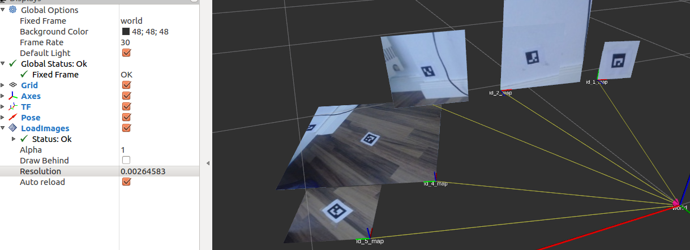

# rviz_pics

## Overview

This package is a rviz plugin that can be used to load images with a certain position and orientation.

**Author: Markus Lamprecht<br />
Maintainer: Markus Lamprecht, 2f4yor@gmail.com<br />**



## Installation

### Dependencies

This software is built on the Robotic Operating System ([ROS]), which needs to be [installed](http://wiki.ros.org) first. Additionally, this package depends on following software:

- (todo)

### Building

In order to install this package, clone the latest version from this repository into your catkin workspace and compile the package using [catkin_tools](https://catkin-tools.readthedocs.io/en/latest/)

``` 
mkdir -p catkin_ws/src
cd catkin_ws/src/
git clone git@github.com:CesMak/rviz_pics.git 
cd ..
catkin init 
catkin build
source devel/setup.bash
```

## Basic Usage

- put all the pic's you want to load in the folder: ```map``` 
- the pics should be named as e.g.

``` 
-0.0432_-0.5083_0.1885_-0.0392_-0.7074_-0.7025_-0.0678_id:1.jpg
x_y_z_qx_qy_qz_qw_(...).jpg  # x, y, z position in m
``` 

## Main Launch file

``` 
roslaunch rviz_pics demo.launch
``` 

## License BSD
If you want to use this package please contact: [me](https://simact.de/about_me).


## TODO's

- See answers of my questions (mlacht) at ORGE forum.
- Make sure that rectangle pics can also be loaded.


[ROS]: http://www.ros.org
[rviz]: http://wiki.ros.org/rviz
[grid_map_msg/GridMap]: https://github.com/anybotics/grid_map/blob/master/grid_map_msg/msg/GridMap.msg
[sensor_msgs/PointCloud2]: http://docs.ros.org/api/sensor_msgs/html/msg/PointCloud2.html
[geometry_msgs/PoseWithCovarianceStamped]: http://docs.ros.org/api/geometry_msgs/html/msg/PoseWithCovarianceStamped.html
[tf/tfMessage]: http://docs.ros.org/kinetic/api/tf/html/msg/tfMessage.html
[std_srvs/Empty]: http://docs.ros.org/api/std_srvs/html/srv/Empty.html
[grid_map_msg/GetGridMap]: https://github.com/anybotics/grid_map/blob/master/grid_map_msg/srv/GetGridMap.srv
[grid_map_msgs/ProcessFile]: https://github.com/ANYbotics/grid_map/blob/master/grid_map_msgs/srv/ProcessFile.srv